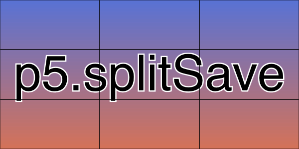

# p5.splitSave
Split up your graphics rendering into equally sized parts.



## Usage
```js
 new p5(p => {
    p.setup = _ => {
        p.createCanvas(600, 300);
        p.pixelDensity(1);
        p.textSize(100);
        p.textAlign(p.CENTER, p.CENTER);
        p.translate(p.width / 2, p.height / 2);
        p.stroke(255);
        p.strokeWeight(5);
        p.fill(0);
        p.text('p5.splitSave', 0, 0);
        p.splitSave('splitSave', 3, 1);
    }
});
```

# Development
$ npm run start

# Build
$ npm run build
